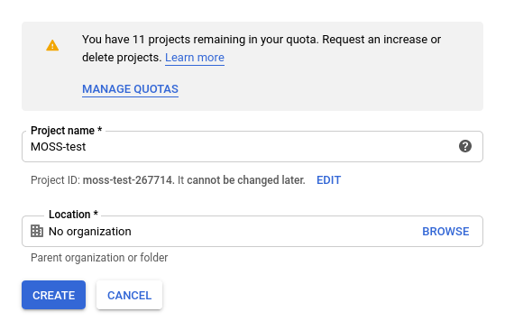
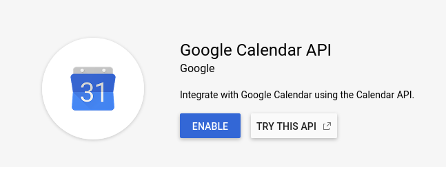
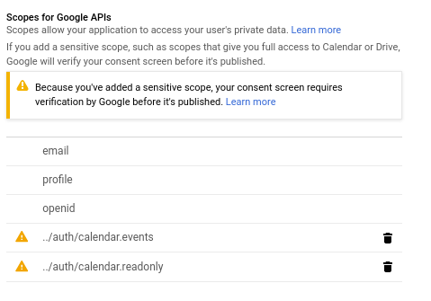
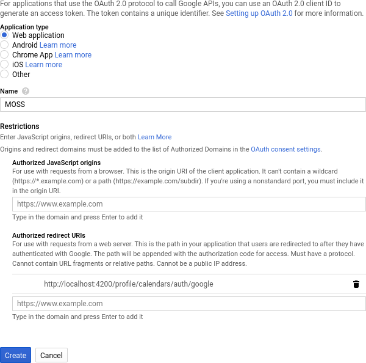
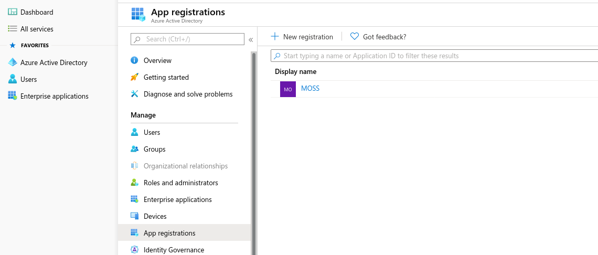
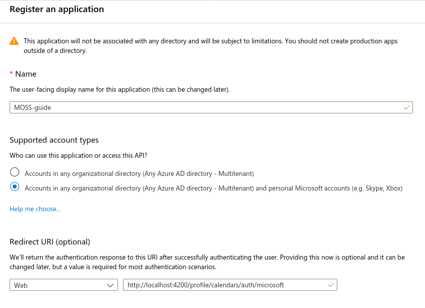
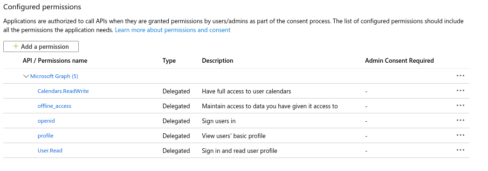
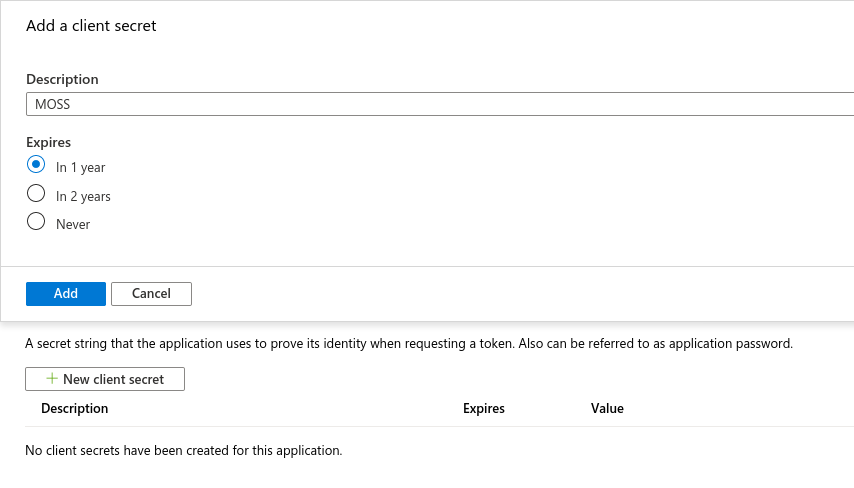

# Full Setup guide
> Some notes: 
> Since this is a collaborative application, setting this up in a private domain might be of advantage.
> The issue with that is, the system MOSS is running on would need a static hostname.
> 
> As a workaround, it might be useful to set it up both locally and on a local network, utilizing the same database.
> The reason is that the APIs cannot be set to have a redirect url within the local network. Only 'localhost' or actual domains work.
> So the ideal 'testing' setup would be one database, one back-end with redirect urls set to `localhost:4200` as shown below, and for each testing person a local front-end instance. At least for the calendar connection steps. Once calendars are added to the database, the system can be used via local network IPs without any issues.
## Third party API setup
Here we set up Google's and Microsoft's Calendar API.
### Google
Go to [Google's Developer Dashboard](https://console.developers.google.com/apis/dashboard) and log in.

Create a new project and name it something like `MOSS`.



Then, go to "Enable APIs and Services" and search for "Calendar".

Enable the Calendar API.



Go to OAuth & Consent screen and create service, give it a name and add following scopes:



Then go to credentials and create an "OAuth client ID" with following settings:



Copy pastable string: `http://localhost:4200/profile/calendars/auth/google`

Save the credentials now displayed on the screen.


### Microsoft

Go to [Microsoft's Azure Active Directory Dasboard](https://aad.portal.azure.com/) and log in.

Go to Select "Azure Active Directory" and "App registrations".



Register a new App, give it a name and almost the same redirect URI `http://localhost:4200/profile/calendars/auth/microsoft`



Go to API permissions and add all scopes in the image below. (Microsoft Graph -> Delegated permissions)



Go to Client secrets and create a new client secret and copy the secret as you will not be able to retrieve it again after dismissing the page:



Go to Overview and copy the Application (client) ID.

That's it for the third party services.

## Database setup
For maximum security, setup a locally hosted [MongoDB instance](https://www.mongodb.com/) according to the guides [here](https://docs.mongodb.com/manual/installation/#mongodb-community-edition-installation-tutorials).

Afterwards, set up a database with a free choice of name, add a user to it with full rights as described [in the security and authentication guide](https://docs.mongodb.com/manual/core/authentication/)

## Back-end setup
Once the database is up and running, the back-end needs to be set up.

For this step, Node.JS and npm have to be installed.

1. If not done, clone the repository `git@gitlab.rlp.net:rhagmaie/meeting-organizer-scheduling-software.git`
2. Change directories into `moss-backend`
3. Run `npm install`
4. Copy example.env to .env `cp example.env .env`
5. Edit the .env file with your favorite editor
6. Change the important lines:
```
MONGO_IP                = 127.0.0.1
MONGO_PORT              = 27017
MONGO_DB                = DATABASE
PORT                    = 3000                          # Port the REST API is served on

MONGO_AUTH              = true                          # False recommended only when testing
MONGO_USER              = admin
MONGO_PASSWORD          = password

JWT_SECRET              = "insecure secret, change"     # Salt for the secret

M_API_CLIENT_SECRET     = ""                            # Enter the created API Microsoft Client secret
M_API_APP_ID            = ""                            # Enter the Microsoft APP id
M_API_SCOPES_URI        = "https://graph.microsoft.com/Calendars.ReadWrite https://graph.microsoft.com/User.Read offline_access openid profile"
M_API_REDIRECT_URI      = "http://localhost:4200/profile/calendars/auth/microsoft"

G_API_CLIENT_ID         = ""                            # Same with Google's ID and Secret
G_API_CLIENT_SECRET     = ""
G_API_REDIRECT_URL      = "http://localhost:4200/profile/auth/google"

SMTP_ENABLED            = false
SMTP_URI                = "http://localhost:4200/"      # Used for the URLs within the E-mails
SMTP_HOST               = ""                            
SMTP_PORT               = 
SMTP_SECURE             = false
SMTP_USER               = ""
SMTP_PASS               = ""
```
7. Upon saving, the server can be run with `node server.js`

> While the email service is not needed, manual activation of user accounts by modifying the database will be required if not.

## Front-end setup

1. Change directories into `meeting-organizer-scheduling-software`
2. Install dependencies with `npm install`
3. Afterwards, it might be needed to install the `@angular-devkit/build-angular` package: `npm install --save-dev @angular-devkit/build-angular`
4. Change the file `src/environments/environment.ts` according to the before mentioned .env file. The Apple part is unused and only left in for later implementation
5. The server can be run with `ng serve --host 0.0.0.0`
6. If the server shall only be available to the local machine, you can omit the `--host 0.0.0.0` part.
7. If you want to let Angular open the webbrowser for you, you can add `--open` to the command line.


# Info
If any questions arise, please feel free to contact me!
